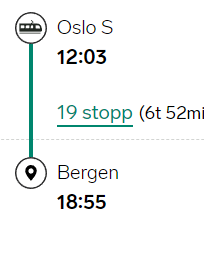
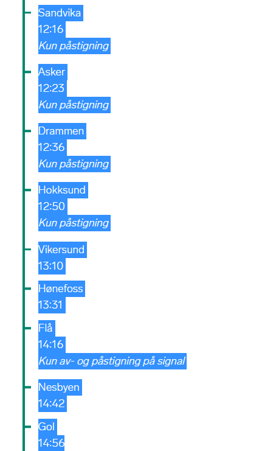

## How to add trip to trips

1. Go to https://www.banenor.no/Jernbanen/Banestrekninger1/ and choose a line

2. Use this command: 

   ```bash
    curl -s {URL} | grep station-name | cut -d'>' -f 2 | cut -d'<' -f1 | sed 's/&#248;/ø/g' | sed 's/&#229;/å/g' | sed 's/&#197;/Å/g' | sed 's/&#216;/Ø/g'
   ```

3. Copy the data to a text editor

4. Then use the find and replace function with regex:

   1. Find: (\w* ?)*
   2. Replace with: \<Name>$0\</Name>

5. Paste them under \<Stations> in the trip.xml file. Remove duplicates

6. Go to https://www.vy.no/ and input your start and end station, and choose a suitable time

7. Choose the one of the options and press **Se alle reisedetaljer** --> {number} stopp 

8. Select everything like show below, and paste it into a a text editor:

9. Copy and paste the start and end station, and remove "Klokken" from the time

10. Remove all "Kun påstigning" and "Kun av- og påstigning på signal"

11. Then use regex magic to make a new schedule for your trip:

    ```
    Find: ^[\w -]*$ 
    Replace: <Schedule>\n\t<Station>\n\t\t<Name>$0</Name>\n\t</Station>
    Find: \d*:\d*
    Replace: \t<Arrival_Time>$0</Arrival_Time>\n\t<Departure_Time>$0</Departure_Time>\n</Schedule>
    ```

12. Paste it under Schedules in your trip

13. Line is is simply from and to station, and TripInterval is user defined

